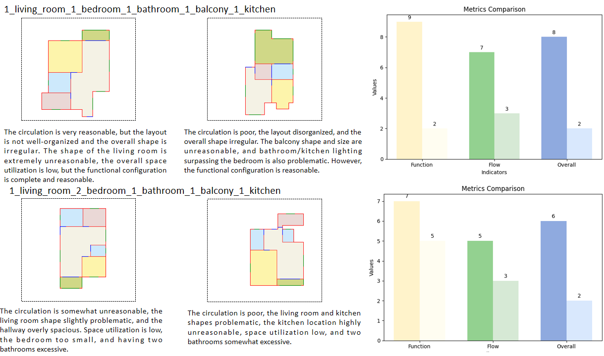

# FloorPlan-LLaMa: Aligning Architects' Feedback and Domain Knowledge in Architectural Floor Plan Generation
Abstract: *Floor plans serve as a graphical language through which architects sketch and communicate their design ideas. Actually, in the Architecture, Engineering, and Construction (AEC) design stages, generating floor plans is a complex task requiring domain expertise and alignment with user requirements. However, existing evaluation methods for floor plan generation rely mainly on statistical metrics like FID, GED, and PSNR, which often fail to evaluate using domain knowledge. As a result, even high-performing models on these metrics struggle to generate viable floor plans in practice. 
To address this, (1) we propose ArchiMetricsNet, the first floor plan dataset that includes functionality, flow, and overall evaluation scores, along with detailed textual analyses. We trained FloorPlan-MPS (Multi-dimensional Preference Score) on it. (2) We develope FloorPlan-LLaMa, a floor plan generation model based on autoregressive framework. To integrate architects' professional expertise and preferences, FloorPlan-MPS serves as the reward model during the RLHF (Reinforcement Learning from Human Feedback)  process, aligning FP-LLaMa with the needs of the architectural community. 
(3) Comparative experiments demonstrate that our method outperforms baseline models in both text-conditional and class-conditional tasks. Validation by professional architects confirms that our approach yields more rational plans and aligns better with human preferences.*


[**Paper**]() | [**Project Page**]() | [**Model Weights**]() | [**Huggingface Demo**]() |


*Figure 1) The framework of FP-LLaMa involves several steps. First, we train a VQ-VAE model, followed by training the FP-LLaMa. Subsequently, we apply RLHF using FloorPlan-MPS to align the model with architects' feedback.*


*Figure 2) Architects assess building floor plans through various professional lenses, which can be broadly categorized into functionality, flow, and overall layout.*


*Figure 3) The 165 Categories of Floor Plans.*


*Figure 4) The Number of Floor Plans in Each Category.*


*Figure 5) The Overall Scores of  Different Floor Plan Types.*


*Figure 6) Scores of Two Typical Layouts.*


*Figure 7) Qualitative Results of Floor Plans Generated by Different Methods on Class-Conditional Task.*


*Figure 8) Qualitative Results of Floor Plans Results on Text-Conditional Task. The detailed prompt input is listed in the appendix.*


*Figure 9) Six Typical Cases of Unreasonable Room Layouts.*


*Figure 10) Average Human Evaluation Score on Class-Conditional Task and Human Evaluation Win Rate on Class-Conditional Task*


*Figure 11) By coordinating multiple FP-LLaMas and FloorPlanChats, the process simulates the interaction between a human architect and a user, iteratively modifying the design until it meets satisfaction.*


*Figure 12) Different Floor Plan Representation Configurations in the Dataset..*


## TODO List

- [x] Release part of ArchiMetricsNet dataset. 
- [ ] Release FloorPlan-LLaMa inference code and pretrain weights.
- [ ] Upload ArchiMetricsNet training dataset.
- [ ] Release FloorPlann-LLaMa code.


## Inference

```
python FloorPlan_LLaMa_Sample.py --dataset ArchiMetricsNet --batch_size 32  --color_configuration 0 --model_path ckpts/exp/model10000.pt --num_samples 64
```
## Train

```
python FloorPlan_LLaMa_Train.py --dataset ArchiMetricsNet --batch_size 32  --color_configuration 0 
